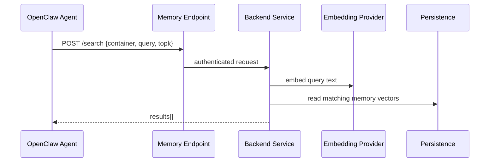
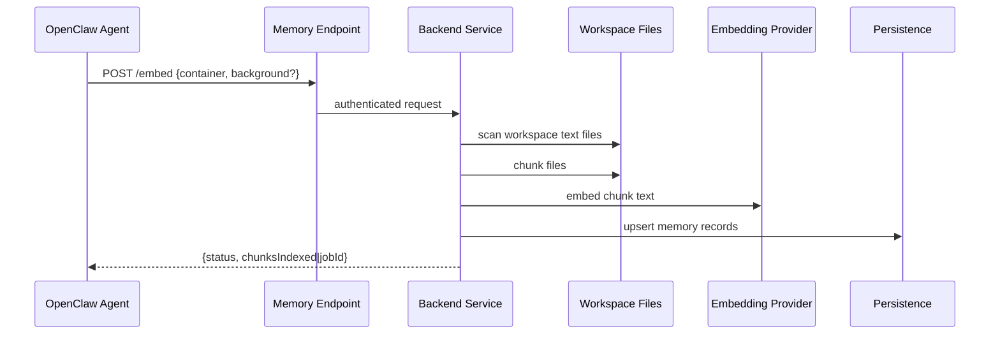

# Dataflow — Transcendence Memory

## Search Path

## Embed / Rebuild Path

## Frontend vs Backend Responsibilities

### Frontend Part
- set endpoint / auth / container
- verify `/health`
- use `/search`
- trigger `/embed` when rebuild is needed

### Backend Part
- install runtime dependencies
- keep backend service healthy
- keep advertised endpoint healthy
- repair auth / provider / persistence issues

## Acceptance Rule

A rollout is only complete when the target environment passes:
1. `GET /health`
2. `POST /search`
3. `POST /embed`
